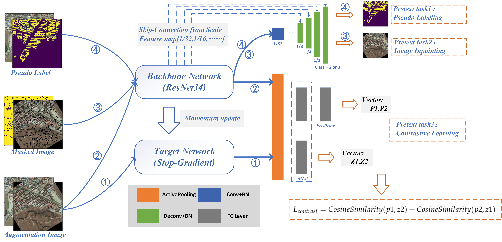

# pytorch-ssl-building_extract
随着近年来能源行业的快速发展，全球能源需求增长，光伏行业的发展越来越受重视。但光伏行业发展受限于用地成本的制约，中心城市以及工业区往往寸金寸土，不具体大面积搭设光伏设备的土地条件。在这种背景下，分布式光伏项目应运而生，建筑物屋顶是分布式光伏设备的理想搭载平台，通过统计建筑物屋顶信息,进而评估光伏潜力，成为了制定光伏发展计划的关键。而基于深度学习方法，通过遥感卫星来提取建筑物屋顶信息是一种理想的方案，但基于深度学习的遥感图像语义分割方法常常需要大规模的标记数据集，遥感数据集的标注往往耗时费力且昂贵。为了减轻数据标注的负担，可以使用大型数据集训练得到的模型作为预训练模型(如ImageNet）为模型提供先验知识，然而现有大部分预训练模型参数并不适合直接迁移至遥感建筑物信息提取。本文基于自监督学习框架，设计了一种交替学习的多任务建筑物信息提取网络结构，通过伪样本引导学习使得代理任务的特征提取结果可以向目标任务靠近，以提高最终效果，我们提出的方法在大多数实验中取得了比现存的对比学习发方法更好的效果。仅使用20-50%左右的标记数据，我们的方法可以实现与随机初始化相当的性能，此外，本文面向光伏潜力评估，以语义分割结果为基础，设计了更为准确的建筑物密度分布统计方法，在中国北京市内进行了相关应用的验证证明了所提出方法的有效性。
 
 
遥感数据集的标注往往过于耗时费力并且昂贵。为了减轻数据标注的负担，可以使用大型数据集训练得到的模型作为预训练模型(如ImageNet）为模型提供先验知识，然而现有大部分预训练模型参数并不适合直接迁移至遥感建筑物信息提取。本文基于自监督学习框架，设计了一种交替学习的多任务建筑物信息提取网络结构，通过伪样本引导学习使得代理任务的特征提取结果可以向目标任务靠近，以提高最终效果，我们提出的方法在大多数实验中取得了最好的效果，尤其是在训练数据较少的情况下。仅使用20%左右的标记数据，我们的方法可以实现与随机初始化相当的性能。:clock1130:
 
 
 主体框架如下图所示：
 

EA_P:
在EA_PGSSL中运行train_batch.py训练拟合得到结果，随后在EA_Transform中训练迁移后的结果
