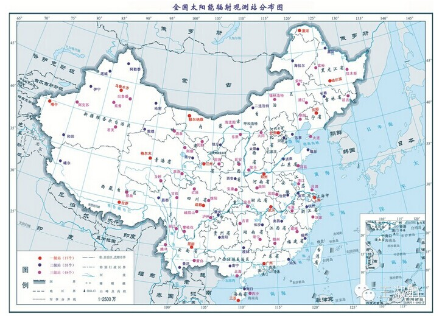

# pytorch-ssl-building_extract
   With the rapid development of the energy industry in recent years and the growth of global energy demand, the development of the photovoltaic industry has received more and more attention. However, the development of the photovoltaic industry is limited by the cost of land use. Central cities and industrial areas are often expensive, and the land conditions for large-scale installation of photovoltaic equipment are not specified. In this context, distributed photovoltaic projects emerge as the times require. Building roofs are an ideal platform for distributed photovoltaic equipment. By calculating the roof information of buildings, evaluating photovoltaic potential has become the key to formulating photovoltaic development plans. Based on deep learning methods, it is an ideal solution to extract building roof information through remote sensing satellites. However, deep learning-based remote sensing image semantic segmentation methods often require large-scale labeled datasets, and the labeling of remote sensing datasets is often time-consuming and labor-intensive. and expensive. In order to reduce the burden of data labeling, a model trained on a large dataset can be used as a pre-trained model (such as ImageNet) to provide prior knowledge for the model. However, most of the existing pre-trained model parameters are not suitable for direct transfer to remote sensing building information. extract. Based on the self-supervised learning framework, this paper designs a multi-task building information extraction network structure with alternate learning. Through pseudo-sample guided learning, the feature extraction results of the proxy task can be closer to the target task to improve the final effect. The method we propose It achieves better results than existing contrastive learning methods in most experiments. Using only about 20-50% labeled data, our method can achieve comparable performance to random initialization. In addition, this paper designs a more accurate statistical method of building density distribution based on the semantic segmentation results for photovoltaic potential evaluation. , the validity of the proposed method is proved by the validation of related applications in Beijing, China.
   
   
 
 
   Labeling of remote sensing datasets is often too time-consuming, labor-intensive and expensive. In order to reduce the burden of data labeling, a model trained on a large dataset can be used as a pre-trained model (such as ImageNet) to provide prior knowledge for the model. However, most of the existing pre-trained model parameters are not suitable for direct transfer to remote sensing building information. extract. Based on the self-supervised learning framework, this paper designs a multi-task building information extraction network structure with alternate learning. Through pseudo-sample guided learning, the feature extraction results of the proxy task can be closer to the target task to improve the final effect. The method we propose The best results are achieved in most experiments, especially with less training data. Using only about 20% of labeled data, our method can achieve comparable performance to random initialization. :clock1130:

EA_P:
Run train_batch.py in EA_PGSSL to train the fit and get the result, then train the transferred result in EA_Transform
